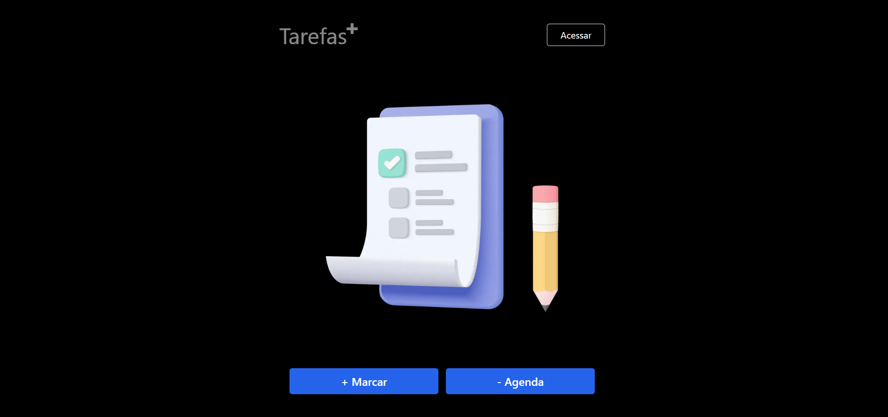
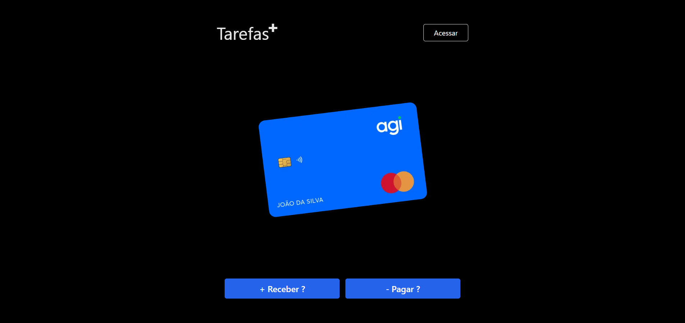

#### Interfaces





#### Animações
```
npm install motion
```

#### Google Auth

```
npm install next-auth
```

```
https://www.udemy.com/course/nextjs-zero-ao-avancado/learn/lecture/36708824#overview
```